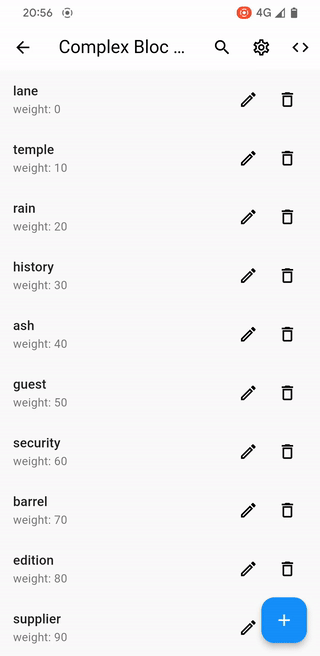

<p align="center">
<a href="https://pub.dev/packages/list_controller" rel="noopener" target="_blank"></a>
<a href="https://opensource.org/licenses/MIT"></a>
<a href="https://codecov.io/gh/astoniocom/list_controller"></a>
<a href="https://github.com/tenhobi/effective_dart" rel="noopener" target="_blank"></a>
</p>

---

A Dart package for creating list controllers with asynchronous loading, pagination, filtering, data actualization, etc. The main objectives of the library: synchronization of processes of data loading and updating, minimizing the load on the data source. The library does not impose any restrictions on the data types used, methods of state management, other packages used, widgets.

[Live demo](https://astoniocom.github.io/list_controller/)



---

- [Features](#features)
- [Advantages](#advantages)
- [Usage](#usage)
- [Generic types](#generic-types)
- [Storing the state of the list](#storing-the-state-of-the-list)
- [Mixins](#mixins)
  - [ListCore](#listcore)
    - [Methods](#methods)
    - [Example](#example)
  - [RecordsLoader](#recordsloader)
    - [Implementation](#implementation)
    - [Methods](#methods-1)
    - [Example](#example-1)
  - [KeysetPagination](#keysetpagination)
    - [Implementation](#implementation-1)
    - [Example](#example-2)
  - [OffsetPagination](#offsetpagination)
    - [Implementation](#implementation-2)
    - [Example](#example-3)
  - [HotList](#hotlist)
    - [Implementation](#implementation-3)
    - [Example](#example-4)
  - [RecordsTracker](#recordstracker)
    - [Implementation](#implementation-4)
    - [Example](#example-5)
- [Synchronization scenarios](#synchronization-scenarios)
- [Bloc list controller](#bloc-list-controller)
- [Additional information](#additional-information)
  - [Pagination with Flutter's ListView](#pagination-with-flutters-listview)
- [Project status](#project-status)

## Features

The package provides the following features for creating list controllers:

- **retrieving, sorting and filtering** list data (see [RecordsLoader](#recordsloader), [example](https://astoniocom.github.io/list_controller/#/filtering_sorting))
- **actualization** of list data without the need to reload it (see [HotList](#hotlist), [example](https://astoniocom.github.io/list_controller/#/tracking_database))
- **infinite scrolling** with support for any pagination strategy: keyset (see [KeysetPagination](#keysetpagination), [example](https://astoniocom.github.io/list_controller/#/keyset_pagination_value_notifier_list)), offset (see [OffsetPagination](#offsetpagination), [example](https://astoniocom.github.io/list_controller/#/offset_pagination_splitted_list)), etc.
- **supporting multiple directions of loading** list data, for example, to create lists with endless forward and backward scrolling ([example](https://astoniocom.github.io/list_controller/#/complex_bidirectional_bloc_list))
- **interrupting data loading**, for example, if filter criteria have been changed (see [RecordsLoader](#recordsloader), [example](https://astoniocom.github.io/list_controller/#/filtering_sorting))
- **reloading data**, for example, in case of an error during the previous load (see [RecordsLoader](#recordsloader), [example](https://astoniocom.github.io/list_controller/#/repeating_queries))
- **displaying intermediate results of loading** list data. For example, adding line-by-line records to the list as they are ready (see [RecordsLoader](#recordsloader), [example](https://astoniocom.github.io/list_controller/#/line_by_line_loading))
- **tracking changes** of a list records to perform arbitrary actions (see [RecordsTracker](#recordstracker), [example](https://astoniocom.github.io/list_controller/#/records_tracking))

## Advantages

- ensures balance between the ease of implementation and flexibility;
- minimizes the load on a data source;
- architecturally independent and compatible with any state management approach;
- compatible with any widgets and can be used even without them;
- works like a constructor — functionality can be added when needed;
- does not impose any restrictions on the object for storing the state;
- supports complex scenarios and allows for implementating additional functionality;
- automatically synchronizes the processes of loading and updating the data with each other;
- provides auxiliary tools that may come in handy when developing a list controller.

## Usage

1. Define the class of a list controller;
2. Add a ListCore mixin into it;
3. Add other mixins with required functionality;
4. Implement the simple class functions required for the mixins you use.

## Generic types

The package uses the following Generic type names:

`Record` — a list entry

`Query` — criteria of the records to be displayed (see [RecordsLoader](#recordsloader)). *For all optimization mechanisms to work, it is important that different `Query` objects with the same contents are equivalent. To do this, use the `equatable` package or override the `==` operator.*

`LoadResult` — representation of the result of loaded data (see [RecordsLoader](#recordsloader)).

`Key` — unique identifier of a record (usually `int` or `String`) (see [HotList](#hotlist)).

`Event` — actions performed on records in the list (see [HotList](#hotlist)).

`DecisionRecord` — simplified representation of `Record` on the basis of which decision on inclusion of `Record` in the list is made. Usually has the same type as `Record` or `Event` (see [HotList](#hotlist)).

`Update` — change in a `Record` (see [RecordsTracker](#recordstracker)).

`Offset` — representation of record offset in case of an offset pagination (for example, `int` in case of page number) (see [OffsetPagination](#offsetpagination)).

## Storing the state of the list

The package does not impose restrictions on the object for storing the list state. You can use any object, from `List<any>` to objects of any complexity.

The library provides the class called `ListState` to store the state. You can use it if it meets your needs. The class is defined as follows.

```dart
@immutable
class ListState<Record, Query> {
  ListState({
    required this.query,
    this.records = const [],
    this.stage = const IdleListStage(),
    this.isInitialized = false,
  });
}
```

`query` — description of the criteria of the records included in the list;

`records` — the list of records;

`stage` — stage the list is at. It may have a value: `ListStage.[idle/error/loading/complete]()`;

`isInitialized` - whether the list is initialized. Typically, this means that the first data retrieval was successful.

*This class will also be used in some of the examples below.*

## Mixins

### ListCore

`ListCore<Record>`

Provides basic functionality for the other parts of the list controller (mixins), as well as the ability to synchronize actions between them.

In the list of mixins of the controller, the `ListCore` mixin must go first.

#### Methods

`waitAllLoadsToComplete() → Future<void>`

Returns `Future`, which completes either immediately if there are no other loads, or upon completion of all loads.

`resetController() → void`

Interrupts all processes occurring in the list controller: loading, updating records and so forth.

#### Example

[Live example](https://astoniocom.github.io/list_controller/#/basic), [code](https://astoniocom.github.io/list_controller/#/basic/code/controller)

```dart
class BasicListController extends ValueNotifier<List<int>>
    with ListCore<int> {
  BasicListController() : super(List<int>.generate(100, (i) => i + 1));

  @override
  void dispose() {
    closeList();
    super.dispose();
  }
}
```

### RecordsLoader

`RecordsLoader<Record, Query, LoadResult>`

Implements the loading of data for the list from a specified source. Whether it is a local database or a remote server.

To load records, use the function `loadRecords(Query query, {LoadingKey loadingKey = defaultLoadingKey})`.

Many functions of this mixin have a `loadingKey` parameter. It is used to identify a particular data load and to synchronize the loads with each other. Its value depends on the mixins used and/or the implementation of the list controller. Loads with the same key preempt each other (can not pass at the same time), and those with different preempt don't. See [Synchronization scenarios](#synchronization-scenarios) for details.

#### Implementation

The following functions need to be implemented in the list controller:

`onRecordsLoadStart({required Query query, required String loadingKey}) → void`

Called at the beginning of loading. Usually, this function should set a loading status in your list state object (for example, it might be executing `...isLoading = true`).

`performLoadQuery({required Query query, required String loadingKey}) → Future<LoadResult>`

The function is responsible for retrieving data from a source. If an error occurs during the loading of data, the function must handle this error (e.g. set error status `...hasError = true` in the list state object and throw `HandledLoadingException`, [example](https://github.com/astoniocom/list_controller/blob/master/demo/lib/examples/repeating_queries/repeating_queries_list_controller.dart#L52)). If it is necessary to interrupt loading for some reason, this can be done by throwing `InterruptLoading`. 

`putLoadResultToState({required Query query, required LoadResult loadResult, required String loadingKey}) → void`

The function should add loaded records to the list state. You may also need to implement resetting the loading status in the list state object (like `...isLoading = false`).

`onRecordsLoadCancel({required Query query, required String loadingKey}) → void`

Called in case of a loading cancellation. This situation can occur when one data load is interrupted by another or by closing the controller (see [Synchronization scenarios](#synchronization-scenarios)). In this function, you may need to implement resetting of the loading status in the list state object (like `...isLoading = false`). The function can also be used when data should be put into the list in a separate `Isolate` in order to close it ([example](https://github.com/astoniocom/list_controller/blob/master/demo/lib/examples/isolate_loading/isolate_loading_list_controller.dart#L124)). 

#### Methods

`isRecordsLoading(LoadingKey loadingKey, {Query? query}) → bool`

Tells whether the loading of records is identified by the `loadingKey` and the `query` is currently being executed.

`isAnyRecordsLoading() → bool`

Tells whether any records are being loaded at the moment.

`isLoadSucessful(LoadingKey loadingKey) → bool?`

Indicates whether the loading of the records identified with the `loadingKey` key has succeeded. If there has been no loading with this key, the result is `null`.

`repeatQuery(String loadingKey) → Future<void>`

Initiates a repeat of a failed loading attempt identified by the `loadingKey` key.

`repeatUnsuccessfulQueries() → Future<void>`

Initiates a repeat of all failed loading attempts.

#### Example

[Live example](https://astoniocom.github.io/list_controller/#/async_records_loading), [code](https://astoniocom.github.io/list_controller/#/async_records_loading/code/controller)

```dart
class ListState {
  const ListState({this.records = const [], this.isLoading = false});

  final List<int> records;
  final bool isLoading;
}

class AsyncRecordsLoadingListController extends ValueNotifier<ListState> 
    with
        ListCore<int>,
        RecordsLoader<int, void, List<int>> {
  AsyncRecordsLoadingListController() : super(const ListState()) {
    loadRecords(null);
  }

  @override
  void dispose() {
    closeList();
    super.dispose();
  }

  // RecordsLoader section:

  @override
  void onRecordsLoadStart({required void query, required LoadingKey loadingKey}) => value = const ListState(isLoading: true);

  @override
  Future<List<int>> performLoadQuery({required void query, required LoadingKey loadingKey}) async {
    await Future.delayed(const Duration(milliseconds: 1500));
    return List<int>.generate(100, (i) => i + 1);
  }

  @override
  void putLoadResultToState({required void query, required List<int> loadResult, required LoadingKey loadingKey}) => value = ListState(records: loadResult);
}
```

### KeysetPagination

`KeysetPagination<Record, Query, LoadResult>`

Implements the loading of the next page of records based on previously loaded records. In the list of mixins, it should be placed after `RecordsLoader`.

To load the first page of records, use the `loadRecords()` function. The next pages of records are loaded by calling the `loadNextPage()` function. If the list is at a stage where loading the next page makes no sense, this loading will not be done. If at the time of calling the function `loadNextPage()` the list is still being actualized, then the loading of the next page will be continued after the actualizing. This is necessary so that the `buildNextPageQuery()` function can build a query to load the next page based on the actual list.

#### Implementation

The following functions need to be implemented in the list controller:

`getListStage(String loadingKey) → ListStage`

The function must convert the current state of the list into an object representing the current stage of the list (`ListStage.idle()`, `ListStage.error()`, `ListStage.loading()`, `ListStage.complete()`).

`buildNextPageQuery(String loadingKey) → Query` 

Based on `loadingKey`, the function should build a `Query` object that will be used to load the next page of the list by the `performLoadingQuery()` function.

#### Example

[Live example](https://astoniocom.github.io/list_controller/#/keyset_pagination_statefull_widget), [code](https://astoniocom.github.io/list_controller/#/keyset_pagination_statefull_widget/code/view)

```dart
typedef ExListState = ListState<int, int>;

class KeysetPaginationListController extends ValueNotifier<ExListState>
    with
        ListCore<int>,
        RecordsLoader<int, int, LoadResult>,
        KeysetPagination<int, int, LoadResult> {

  ...

  // KeysetPagination section:

  @override
  ListStage getListStage(LoadingKey loadingKey) => value.stage;

  @override
  int buildNextPageQuery(LoadingKey loadingKey) => value.records.last;
}
```

### OffsetPagination

`OffsetPagination<Record, Query, LoadResult, Offset>`

Implements the loading of list records based on offset `Offset` (for example, it can be `int` with page order number). In the mixins list, it should go after `RecordsLoader`.

Use the `loadPage(Offset offset)` function to load pages with records. 

#### Implementation

The following functions need to be implemented in the list controller:

`offsetToLoadingKey(Offset offset) → String`

This function should generate a loading key based on the offset `Offset`. If multiple pages can be loaded simultaneously, each `Offset` must have a unique loading key. Otherwise, it can have any value ([example](https://github.com/astoniocom/list_controller/blob/master/demo/lib/examples/offset_pagination_splitted_list/offset_pagination_splitted_list_controller.dart#L123)).

`buildOffsetQuery(Offset offset) → Query` 

Based on `offset`, the function should build a `Query` object that will be used to load the list page by the `performLoadingQuery()` function.

#### Example

[Live example](https://astoniocom.github.io/list_controller/#/offset_pagination_list), [code](https://astoniocom.github.io/list_controller/#/offset_pagination_list/code/controller)

```dart
class OffsetPaginationListController extends ValueNotifier<ExListState>
    with
        ListCore<int>,
        RecordsLoader<int, ListQuery, LoadResult>,
        OffsetPagination<int, ListQuery, LoadResult, int> {
  ...

  // OffsetPagination section

  @override
  String offsetToLoadingKey(int offset) => 'page$offset';

  @override
  ListQuery buildOffsetQuery(int offset) => value.query.copyWith(page: offset);
}
```

### HotList

`HotList<Key, Event, DecisionRecord, Record>`

Implements the updating (actualization) of individual list entries.

If some records of the list have been changed, then — instead of updating the entire list — it is more efficient to update only changed records in order to keep the list up to date. `HotList` simplifies this work.

The following is the process of updating the list:

**changes**<sup>1</sup> —[`Event`]⟶ **buffer**<sup>2</sup> —[`List<Event>`]⟶ **expandHotListEvents**<sup>3</sup> —[`RecordUpdates<DecisionRecord, Key>`]⟶ **processing**<sup>4</sup> —[`HotListChanges<DecisionRecord, Key>`]⟶ **convertDecisionRecords**<sup>5</sup> —[`HotListChanges<Record, Key>`]⟶ **updateHotList**<sup>6</sup>

1. To start `HotList`, you need to call the function `initHotList(Stream<Event> changes)`, specifying the notification stream of changes in the data source.
2. If data loading is in progress, the controller will wait for the loading to complete by buffering events.
3. The `expandHotListEvents` function should convert the event list into a `RecordUpdates` object. This object contains a simplified representation of the records. The simplified representation should be sufficient to decide whether to include a record in the list.
4. Based on `RecordUpdates`, the controller makes decisions about including records in the list.
5. The simplified record representation `DecisionRecord` is converted into a `Record` object.
6. Updating of the list.

If you are working with transactional databases, it is important that events are processed only after the transaction is closed. To reduce the load on the list controller and data source, it is recommended to receive these events (which occurred during the transaction) in batches. In this case, `Event` will be a list of events and the definition of the initialization function `HotList` will have approximately the following form `initHotList(Stream<List<MyEvent>> changes)`.

*If the list managed by the controller contains records that are updated automatically (such as the list of `Cubit`s), the `initHotList` function should not receive events related to record updates, and the `expandHotListEvents` function should return a `RecordUpdates` object with an empty `updatedRecords` parameter.*

#### Implementation

The following functions need to be implemented in the list controller:

`expandHotListEvents(List<Event> events) → FutureOr<RecordUpdates<DecisionRecord, Key>>`

Converts an `Event` notification list into an `RecordUpdates` object containing the lists of created, updated and deleted entries. The entries of this object will be used to make decisions about including specific entries in the list. The `Event` list included in the function is formed from the events that occurred during the time the records were loaded from the data source (see [Synchronization scenarios](#synchronization-scenarios)). If no data was loaded, there will be only one item in this list.

`getDecisionRecordKey(DecisionRecord record) → Key`

The function should return the unique identifier of the `DecisionRecord` record.

`hasListRecord(Key key) → bool`

The function should tell if the current list contains a record with the unique identifier `Key`.

`recordFits(DecisionRecord record) → bool`

The function should tell if the `DecisionRecord` is suitable for being added to the list.

`convertDecisionRecords(Set<DecisionRecord> records) → Future<List<Record>>`

The function should convert the list of `DecisionRecord` into a list of `Record`.

`updateHotList(HotListChanges<Record, Key> changes)`

Called when the list of records needs to be modified. Changes are described by the `HotListChanges` object that contains records to be added to the list and unique identifiers (keys) of records to be removed from the list.

#### Example

*Since demonstrating how `HotList` works requires a data source with rather complex functionality, we use `ExampleRecordRepository` as a data source to simplify the example. Its code is available at the [link](https://github.com/astoniocom/list_controller/tree/master/demo/mock_datasource).*

[Live example](https://astoniocom.github.io/list_controller/#/tracking_database), [code](https://astoniocom.github.io/list_controller/#/tracking_database/code/controller)

```dart
typedef ExListState = ListState<ExampleRecord, ExampleRecordQuery>;

class ActualizingListController extends ValueNotifier<ExListState>
    with
        ListCore<ExampleRecord>,
        RecordsLoader<ExampleRecord, ExampleRecordQuery, List<ExampleRecord>>,
        HotList<int, ExampleRecordEvent, ExampleRecord, ExampleRecord> {
  ActualizingListController(this.repository) : super(ExListState(query: const ExampleRecordQuery(weightLte: 100))) {
    loadRecords(value.query);

    initHotList(repository.dbEvents);
  }

  ...

  // HotList section:

  @override
  Future<RecordUpdates<ExampleRecord, int>> expandHotListEvents(List<ExampleRecordEvent> events) async {
    final Iterable<ID> createdIds = events.whereType<ExampleRecordCreatedEvent>().map((event) => event.id);
    final Iterable<ID> updatedIds = events.whereType<ExampleRecordUpdatedEvent>().map((event) => event.id);
    final List<ExampleRecord> retrievedRecords = await repository.getByIds({...createdIds, ...updatedIds});

    return RecordUpdates(
      insertedRecords: retrievedRecords.where((r) => createdIds.contains(r.id)),
      updatedRecords: retrievedRecords.where((r) => updatedIds.contains(r.id)),
      deletedKeys: events.whereType<ExampleRecordDeletedEvent>().map((e) => e.id),
    );
  }

  @override
  ID getDecisionRecordKey(ExampleRecord record) => record.id;

  @override
  bool hasListRecord(ID key) => value.records.map((record) => record.id).contains(key);

  @override
  bool recordFits(ExampleRecord record) => value.query.fits(record);

  @override
  Iterable<ExampleRecord> convertDecisionRecords(Set<ExampleRecord> records) => records;

  @override
  void updateHotList(HotListChanges<ExampleRecord, int> changes) {
    final List<ExampleRecord> newRecordsList = value.records.where((r) => !changes.recordKeysToRemove.contains(r.id)).toList()
      ..insertAll(0, changes.recordsToInsert)
      ..sort(value.query.compareRecords);

    value = value.copyWith(records: newRecordsList);
  }
}
```

### RecordsTracker

`RecordsTracker<Record, Update>`

Tracks changes of individual records in the list. The records must be able to provide a `Stream` for tracking (as records, for example, `Cubit`s from package `Bloc` can be used). When the list is changed, the new records must be registered for tracking by calling `registerRecordsToTrack(List<Record> records)`.

#### Implementation

The following functions need to be implemented in the list controller:

`buildTrackingStream(Record record) → Stream<Update>`

The function should return a `Stream` of `record` updates.

`onTrackEventOccur(List<Update> updatedRecords)`

Called when there were changes in the records. `updatedRecords` contains a list of changes during `RecordsTracker.trackingPeriod`.

#### Example

[Live example](https://astoniocom.github.io/list_controller/#/records_tracking), [code](https://astoniocom.github.io/list_controller/#/records_tracking/code/controller)


The following data structures are used in the example:

```dart
import 'package:bloc/bloc.dart';

class RecordData {
  RecordData({required this.color, required this.weight, required this.initPosition});
  final Color color;
  final int weight;
  final int initPosition;
}

class RecordCubit extends Cubit<RecordData> {
  RecordCubit(int initPosition)
      : super(RecordData(
          color: Colors.primaries[Random().nextInt(Colors.primaries.length)],
          weight: 1,
          initPosition: initPosition,
        ));

  void increase() => emit(RecordData(weight: state.weight + 1, color: state.color, initPosition: state.initPosition));
}
```

Controller example:

```dart
class RecordTrackingListController extends ValueNotifier<List<RecordCubit>>
    with
        ListCore<RecordCubit>,
        RecordsTracker<RecordCubit, RecordData> {
  RecordTrackingListController()
      : super(List<RecordCubit>.generate(10, (i) {
          return RecordCubit(i);
        }).toList()) {
    registerRecordsToTrack(value);
  }

  @override
  void dispose() {
    for (final record in value) {
      record.close();
    }

    closeList();
    super.dispose();
  }

  // RecordsTracker section:

  @override
  Stream<RecordData> buildTrackingStream(Cubit<RecordData> record) => record.stream;

  @override
  void onTrackEventOccur(List<RecordData> updatedRecords) {
    value = List.of(value)..sort((a, b) => b.state.weight.compareTo(a.state.weight));
  }
}

```

## Synchronization scenarios

The table below shows how different sequences of actions on the list will be handled.

The first column shows the actions are being performed. The header shows the requests to perform the new action. The `key_` and `query_` in the brackets are given to understand whether the new action will be performed with new or the same keys and queries as the action being performed. The intersection describes the way each action will be handled:

continue — the action will continue;

ignore — the action will not be executed;

cancel — the action will be canceled;

wait — before starting a new action, it will wait for the completion of the previous action.

| ↓ action being performed; triggered action → | A. Load (key1, query1)       | B. Load (key1, query2)       | C. Load (key2, query3)       | D. Actualize records     |
| ------------------------------------------------- | ---------------------------- | ---------------------------- | ---------------------------- | ------------------------ |
| 1. Loading (key1, query1)                         | 🟩 1 — continue; A — ignore   | 🟥 1 — cancel; B — continue   | 🟦 1 — continue; C — continue | 🟪 1 — wait; D — continue |
| 2. Loading (key1, query2)                         | 🟥 2 — cancel; A — continue   | 🟩 2 — continue; B — ignore   | 🟦 2 — continue; C — continue | 🟪 2 — wait; D — continue |
| 3. Loading (key2, query3)                         | 🟦 3 — continue; A — continue | 🟦 3 — continue; B — continue | 🟩 3 — continue; C — ignore   | 🟪 3 — wait; D — continue |
| 4. Actualizing records                            | 🟦 4 — continue; A — continue | 🟦 4 — continue; B — continue | 🟦 4 — continue; C — continue | 🟪 4 — wait; D — continue |

## Bloc list controller

The `list_controller` package supports the Bloc library. To simplify the creation of event handlers, you can use the event classes provided by the package if they are relevant to your tasks.

`LoadRecordsEvent<Query>`

Initiates the loading of records. Mirrors the `RecordsLoader.loadRecords` function that should be called in the handler.

```dart
void _onLoadRecords(LoadRecordsEvent<ExampleRecordQuery> event, Emitter<ListState> emit) => loadRecords(event.query, loadingKey: event.loadingKey);
```

`RecordsLoadStartEvent<Query>`

The event must be called from the overridden function `RecordsLoader.onRecordsLoadStart`. The handler must perform the same actions as those for this function.

```dart
@override
void onRecordsLoadStart({required ExampleRecordQuery query, required LoadingKey loadingKey}) =>
    add(RecordsLoadStartEvent(query: query, loadingKey: loadingKey));

void _onRecordsLoadStart(RecordsLoadStartEvent<ExampleRecordQuery> event, Emitter<ListState> emit) {
  ...
```

`RecordsLoadCancelEvent<Query>`

The event must be called from the overridden function `RecordsLoader.onRecordsLoadCancel`. The handler must perform the same actions as those for this function.

```dart
@override
void onRecordsLoadCancel({required ExampleRecordQuery query, required LoadingKey loadingKey}) =>
    add(RecordsLoadCancelEvent(query: query, loadingKey: loadingKey));

void _onRecordsLoadCancel(RecordsLoadCancelEvent<ExampleRecordQuery> event, Emitter<ListState> emit) {
  ...
```

`LoadingErrorEvent<Query>`

The event can be used when an error occurs in the overridden `RecordsLoader.performLoadQuery` function. It should be used to set an error in the list state. Normally, a `HandledLoadingException` should be thrown after this event is called.

```dart
@override
Future<List<ExampleRecord>> performLoadQuery({required ExampleRecordQuery query, required String loadingKey}) async {
  try {
    return await loadMyRecords(...);
  } on SomeException {
    add(LoadingErrorEvent<ExampleRecordQuery>(query: query, loadingKey: loadingKey));
    throw HandledLoadingException();
  }
}
```

`PutLoadResultToStateEvent<Query, LoadResult>`

The event must be called from the overridden function `RecordsLoader.putLoadResultToState`. The handler must perform the same actions as those for this function.

```dart
@override
void putLoadResultToState({required ExampleRecordQuery query, required List<ExampleRecord> loadResult, required LoadingKey loadingKey}) =>
    add(PutLoadResultToStateEvent(query: query, loadResult: loadResult, loadingKey: loadingKey));

void _onPutLoadResultToState(PutLoadResultToStateEvent<ExampleRecordQuery, List<ExampleRecord>> event, Emitter<ListState> emit) {
  ...
```

`RepeatQueryEvent`

Triggers the reloading of records in case the previous attempt failed. Mirrors the `RecordsLoader.repeatQuery` function that should be called in the handler.

```dart
void _onRepeatQuery(RepeatQueryEvent event, Emitter<ListState> emit) => repeatQuery(event.loadingKey);
```

`LoadNextPageEvent`

Triggers the loading of the next page of records. Usually used together with the `KeysetPagination` or `OffsetPagination` mixins and used to call the `KeysetPagination.loadNextPage` or `OffsetPagination.loadPage` functions respectively.

```dart
void _onLoadNextPage(LoadNextPageEvent event, Emitter<ListState> emit) => loadNextPage();
```

`LoadNextPageDirectedEvent`

The purpose is the same as the `LoadNextPageEvent` event, except that the constructor contains the `loadingKey` parameter. It is used for handling lists that have two or more directions of records to load.

`UpdateHotListEvent<Record, Key>`

The event must be called from an overridden function `HotList.updateHotList`. The handler must perform the same actions as for this function.

```dart
@override
void updateHotList(HotListChanges<ExampleRecord, PK> changes) => add(UpdateHotListEvent(changes: changes));

void _onUpdateHotList(UpdateHotListEvent<ExampleRecord, PK> event, Emitter<ListState> emit) {
  ...
```

## Additional information

### Pagination with Flutter's ListView

There are different ways of initiating the loading of the next data page. The simplest is when a certain item from the end of the list is displayed on the screen:

```dart
@override
Widget build(BuildContext context) {
  return ListView.builder(
    itemCount: listState.records.length,
    itemBuilder: (context, index) {
      // The number of the record from the end of the list, the display of which initiates the next page load:
      const recordsLoadThreshold = 1;

      if (index >= listState.records.length - recordsLoadThreshold) {
        WidgetsBinding.instance.addPostFrameCallback((_) {
          loadNextPage(); // From KeysetPagination mixin
        });
      }

      return ListTile(title: Text(listState.records[index]));
    },
  );
}
```

## Project status

This package is currently under development and the API can change in the future.
